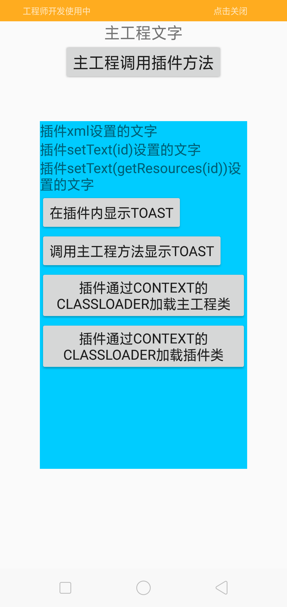
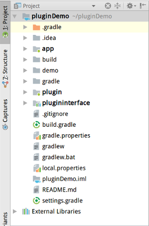
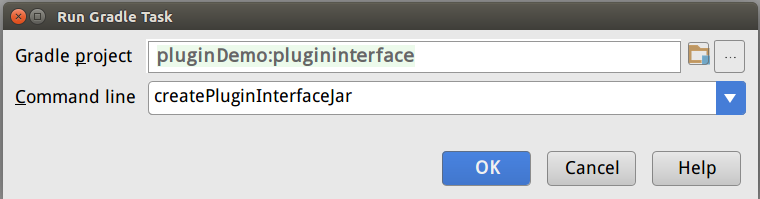
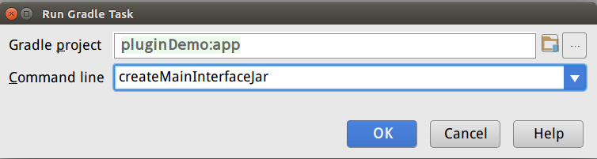
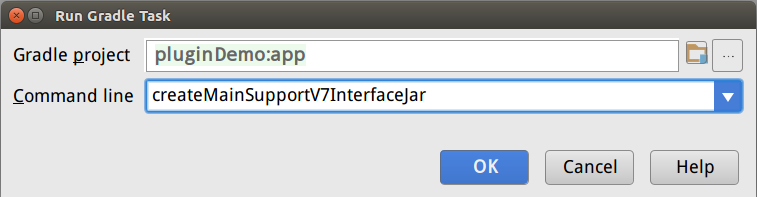
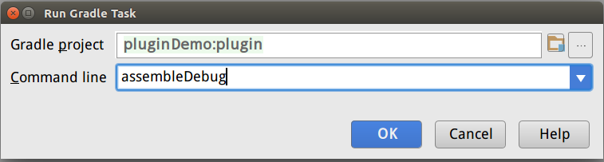

# 精简的插件化fragment加载演示
本demo演示了如何加载以插件apk方式存在的fragment，完成了:
- 用尽可能少的代码实现插件fragment的代码和资源的加载
- 提供了生成插件框架所需的各种中间件的gradle代码

## 演示

## 如何运行
1. 下载该项目
2. 执行gradle sync以下载必要的依赖，完成后的工程结构:

3. 按顺序执行以下gradle task:

　　

4. 运行：

## 实现目标
- 主工程能加载了插件apk中的fragment
- 主工程能调用插件中的代码
- 插件能调用自己和主工程的代码
- 主工程和插件能找到各自的资源
- 主工程和插件的资源能出现在同一个activity中
- 主工程和插件能使用共同的supportV7包和配套主题

## 原理
### 工程
