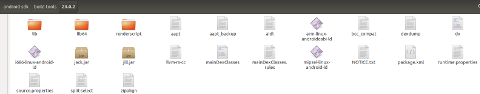
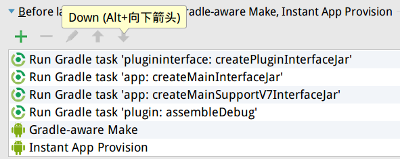

# 插件化fragment加载演示
本demo演示了如何加载以插件apk方式存在的fragment，完成了:
- 用尽可能少的代码实现插件fragment的代码和资源的加载
- 提供了编译工程所需的中间jar包的生成方式

## 演示
- 白色背景部分是主工程activity
- 蓝色背景部分是插件fragment
- 白色的主工程activity中加载了蓝色的插件fragment

## 如何运行
1. 通过Android Studio的package manager安装23.0.2版本的build-tools，和android 25 platform
2. 项目使用的gradle版本是3.5，android gradle plugin版本是2.2.0，如果没装的话可以提前下载
3. 在项目的build-tools/23.0.2目录中的三个平台的aapt中，选择合适自己平台的aapt，覆盖自己android sdk目录中build-tools/23.0.2下的aapt，记得备份原有的aapt:

4. 打开项目，执行gradle sync以下载必要的依赖，完成后的工程结构:

5. 每次运行前，请按顺序执行以下gradle task:

　　

或者直接把这几个task设置到AS的run configuration里：

6. 运行：

## 实现目标
- 主工程能加载了插件apk中的fragment
- 主工程能调用插件中的代码
- 插件能调用自己和主工程的代码
- 主工程和插件能找到各自的资源
- 主工程能通过固定的资源id找到插件的资源
- 插件能通过固定的资源id找到主工程的资源
- 主工程和插件的资源能出现在同一个activity中
- 主工程和插件能使用共同的supportV7包和配套主题

## 工程结构
- app模块是主工程，使用com.android.application的plugin，是app类型的module
- plugin模块是插件工程，使用com.android.application的plugin，也是app类型的module
- plugininterface模块是生成主工程和插件工程的通信接口jar包的工程，使用com.android.library的plugin，是library类型的module

## 构建流程
1. :plugininterface:createPluginInterfaceJar的gradle task会将plugininterface工程中的接口代码打成jar包，放在其pluginInterfaceJar目录下,因为app工程以compile形式依赖此jar包，plugin工程以provided形式依赖此jar包，所以app和plugin工程在编译时就可以在相同的接口代码上实现具体功能，在运行时，主工程可以通过这些接口代码来调用插件方法
2. :app:createMainInterfaceJar的gradle task会将app工程中的所有代码打成jar包，放在plugin工程的mainInterfaceJar目录下，plugin工程以provided形式依赖此jar包，所以plugin工程在编译时可以使用主工程代码，在运行时因为类加载器的委托机制，在加载主工程代码时，会通过插件类加载器的上级加载器，即主工程的类加载器来加载，所以也可以使用主工程代码
3. :app:createMainSupportV7InterfaceJar的gradle task会将主工程依赖的supportV7包的代码打成jar包，放在plugin工程的mainSupportV7InterfaceJar目录下，plugin工程以provided形式依赖此jar包，所以与上一条类似，使的编译和运行时插件可以使用supportV7包的代码
4. :plugin:assembleDebug的gradle task会构建插件工程，生成插件apk并放在主工程的src/main/assets目录下，主工程运行时会从这个位置提取插件apk，复制到合适位置并加载，完成插件加载过程

## 运行流程
1. 主工程启动后，application的onCreate方法里会从自己的assets目录下提取插件，复制到应用的私有目录，并创建用来加载插件代码的类加载器
2. 主工程的MainActivity会在其attachBaseContext方法中创建可以同时访问主工程和插件资源的Resources实例，结合上面一条的插件类加载器，一起替换进baseContext中
3. 主工程的MainActivity会在其onResume方法中通过反射创建插件fragment的实例，然后按照正常fragment添加流程添加此fragment，完成插件fragment的显示

## 原理
- 代码的加载：
    - 主工程使用DexClassLoader类加载器加载插件fragment，插件fragment的所有关联类也会用同一加载器来处理，所以插件可以加载并调用插件代码
    - 此DexClassLoader加载器的上级加载器设置为主工程的类加载器，类加载的委托机制会起作用，所以插件可以加载并调用主工程代码
    - 插件代码被加载后，主工程有插件类的引用，并且之前以compile形式依赖了plugininterface工程中的接口代码，所以可以通过这些接口调用插件代码
- 资源的加载：
    - aapt是定制的，将插件的资源id的package分段定成了71，而主工程的package分段还是默认的7f，所以插件和主工程的资源id不会冲突
    - 主工程的application和activity的attachBaseContext中，会创建一个兼容主工程和插件资源的Resources实例，并替换进baseContext中，所以主工程可以加载插件资源；又因为fragment的context就是其hostActivity，所以fragment可以加载自己和主工程的资源
    - 主工程通过资源id访问插件资源，以及插件通过资源id访问主工程资源，用到的资源id必须是用res/values/public.xml固定过的，以保证每次编译，这些资源的资源id是不变的，这样才能支持代码中以固定的id值来访问这些资源
